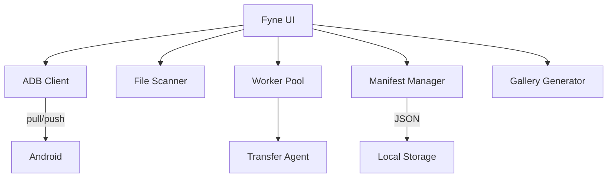

# 📱 AndroidSafeLocal

<p align="center">
  
  
  
  
</p>

**AndroidSafeLocal** is a desktop application for performing local backups of Android devices. It offers fast backup, intelligent restore, automatic deduplication, and HTML gallery generation.

## ✨ Features

- 🔍 **Device Scanning** - Scan connected Android devices via USB
- ⬇️ **Smart Backup** - Transfer files with automatic year/month organization
- 🔄 **Deduplication** - Skip already backed-up files automatically
- 📋 **Manifest System** - Generate manifest.json for precise restoration
- ⬆️ **Intelligent Restore** - Restore files to original locations or fallback folder
- 🖼️ **Gallery Generation** - Create HTML galleries with thumbnails
- 🌙 **Midnight Theme** - Beautiful dark theme UI

## 📸 Screenshots

| Main Interface |
|:-------------:|
| *Modern dashboard with device status, configuration, and action buttons* |

## 🛠️ Requirements

- **Windows 10+**
- **Go 1.21+** (for building from source)
- **ADB** (Android Debug Bridge) in PATH
- **CGO enabled** (required for Fyne GUI)
- **USB Debugging** enabled on Android device

## 🚀 Quick Start

### Download & Run
1. Download `AndroidSafeLocal.exe` from Releases
2. Connect your Android device via USB with **USB Debugging** enabled
3. Run `AndroidSafeLocal.exe`

### Build from Source
```bash
# Clone the repository
git clone https://github.com/yourusername/AndroidSafeLocal.git
cd AndroidSafeLocal

# Build (Windows)
.\build.bat

# Or manually
set CGO_ENABLED=1
go build -ldflags "-H=windowsgui" -o AndroidSafeLocal.exe ./cmd/android-safe-local
```

## 📖 Usage

### Main Interface

| Section | Description |
|---------|-------------|
| **Device Status** | Shows connection status of your Android device |
| **Configuration** | Source path (mobile) and destination path (PC) |
| **Actions** | Scan, Backup, Gallery, and Restore buttons |
| **Activity Log** | Real-time operation log with timestamps |

### Workflow

1. **🔎 Scan Files** - Click to scan the device and discover files
2. **⬇️ Start Backup** - Transfer files to PC with automatic organization
3. **🖼️ Generate Gallery** - Create an HTML gallery (optional)
4. **⬆️ Restore** - Push files back to device when needed

### Backup Details
- Files are organized by **Year/Month** folders
- Duplicate files are automatically skipped
- A `manifest.json` is generated for future restores

### Restore Modes
- **With Manifest**: Each file returns to its original location
- **Without Manifest**: All files go to `/sdcard/Restored`

## 🏗️ Architecture



## 📁 Project Structure

```
AndroidSafeLocal/
├── cmd/android-safe-local/
│   ├── main.go          # Entry point & UI
│   └── theme.go         # Midnight visual theme
├── internal/
│   ├── adb/             # ADB client (run, push, pull, kill-server)
│   ├── backup/          # Worker Pool + Transfer Agent
│   ├── dedup/           # Deduplication registry
│   ├── device/          # File scanner (Walker)
│   ├── gallery/         # HTML generator + Thumbnails
│   ├── manifest/        # Manifest.json management
│   └── sorter/          # Year/Month organization
├── build.bat            # Windows build script
├── go.mod               # Go module definition
└── README.md            # This file
```

## 🎨 Theme

AndroidSafeLocal uses a custom **Midnight** theme:

| Color | Usage | Hex |
|-------|-------|-----|
| Background | Main background | `#1E1E2E` |
| MenuBackground | Dropdowns/Popups | `#2A2A3C` |
| Primary | Buttons/Accents | `#89B4FA` |
| Foreground | Text | `#FFFFFF` |
| Error | Error messages | `#F38BA8` |

## 🔧 Troubleshooting

| Problem | Solution |
|---------|----------|
| "ADB not initialized" | Reconnect USB cable or restart ADB server |
| "Permission denied" | Normal for system folders - app continues |
| ADB processes remain open | Close app properly (don't force-close) |
| Device not detected | Enable USB Debugging in Developer Options |
| Build fails | Ensure CGO_ENABLED=1 and gcc is installed |

## 💡 Tips

- **Incremental Backups**: Already backed-up files are skipped automatically
- **Original Location Restore**: Always backup first to generate the manifest
- **Gallery Viewing**: Open `index.html` in any web browser
- **Large Backups**: Use a fast USB cable for better performance

## 📋 Dependencies

| Package | Purpose |
|---------|---------|
| [fyne.io/fyne/v2](https://fyne.io) | Cross-platform GUI framework |
| [disintegration/imaging](https://github.com/disintegration/imaging) | Image processing for thumbnails |

## 🤝 Contributing

Contributions are welcome! Please feel free to submit a Pull Request.

1. Fork the repository
2. Create your feature branch (`git checkout -b feature/AmazingFeature`)
3. Commit your changes (`git commit -m 'Add some AmazingFeature'`)
4. Push to the branch (`git push origin feature/AmazingFeature`)
5. Open a Pull Request

## 📄 License

This project is licensed under the MIT License - see the [LICENSE](LICENSE) file for details.

## 👤 Author

**Carlos Gutiérrez**

---

<p align="center">
  Made with ❤️ and Go
</p>
