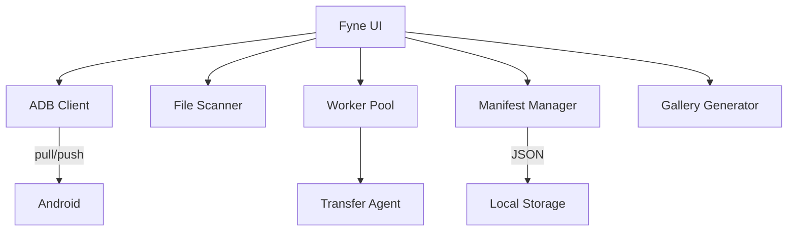

# Documentación de AndroidSafeLocal

## 🔧 1. Documentación Técnica

### 1.1 Descripción General
**AndroidSafeLocal** es una aplicación de escritorio para realizar copias de seguridad locales de dispositivos Android. Ofrece backup rápido, restauración inteligente y generación de galerías HTML.

### 1.2 Arquitectura


### 1.3 Tecnologías
| Componente | Tecnología |
|------------|------------|
| Lenguaje | Go 1.21+ |
| GUI | Fyne v2 |
| Conectividad | ADB (Android Debug Bridge) |
| Imágenes | `disintegration/imaging` |

### 1.4 Estructura del Proyecto
```
AndroidSafeLocal/
├── cmd/android-safe-local/
│   ├── main.go          # Entry point y UI
│   └── theme.go         # Tema visual "Midnight"
├── internal/
│   ├── adb/             # Cliente ADB (run, push, pull, kill-server)
│   ├── backup/          # Worker Pool + Transfer Agent
│   ├── dedup/           # Registro de deduplicación
│   ├── device/          # Scanner de archivos (Walker)
│   ├── gallery/         # Generador HTML + Miniaturas
│   ├── manifest/        # Gestión de manifest.json
│   └── sorter/          # Organización Año/Mes
└── build.bat            # Script de compilación Windows
```

### 1.5 Modelos de Datos
- **`device.File`**: Archivo en el dispositivo (Path, Size, Timestamp, IsDir).
- **`backup.Job`**: Tarea de transferencia (Source, Dest, Size).
- **`manifest.Entry`**: Registro de backup (OriginalPath, LocalPath, Size, Timestamp).
- **`manifest.Manifest`**: Colección de Entries guardada en JSON.

### 1.6 Flujos Principales

#### Backup
1. Escanea el dispositivo (`ls -R -l`).
2. Inicializa registro de deduplicación.
3. Para cada archivo: verifica si ya existe → si no, transfiere (`adb pull`).
4. Guarda `manifest.json` con rutas originales.

#### Restore
1. Intenta cargar `manifest.json`.
2. **Si existe**: Restaura cada archivo a su ruta original.
3. **Si no existe**: Copia todo a `/sdcard/Restored`.

### 1.7 Configuración
- **Requisitos**: Windows 10+, ADB en PATH, CGO habilitado.
- **Compilación**: `.\build.bat` genera `AndroidSafeLocal.exe`.

### 1.8 Limpieza de Procesos
Al cerrar la aplicación, se ejecuta automáticamente `adb kill-server` para evitar procesos huérfanos.

---

## 👤 2. Manual de Usuario

### 2.1 Instalación
1. Descargue `AndroidSafeLocal.exe`.
2. Colóquelo en una carpeta (ej. Escritorio).
3. Conecte su móvil por USB con **Depuración USB** activada.

### 2.2 Pantalla Principal
| Sección | Descripción |
|---------|-------------|
| **Device Status** | Muestra si el móvil está conectado. |
| **Configuration** | Rutas de origen (móvil) y destino (PC). |
| **Actions** | Botones: Scan, Backup, Gallery, Restore. |
| **Activity Log** | Registro de operaciones con timestamps. |

### 2.3 Funciones

#### 🔎 Scan Files
Lee el contenido del móvil. Ejecute esto primero.

#### ⬇️ Start Backup
Copia archivos del móvil al PC:
- Organiza por Año/Mes.
- Evita duplicados automáticamente.
- Genera `manifest.json` para futuras restauraciones.

#### 🖼️ Generate Gallery
Crea una página web (`index.html`) con miniaturas de sus fotos.

#### ⬆️ Restore
Restaura archivos al móvil:
- **Con manifest**: Cada archivo vuelve a su ubicación original.
- **Sin manifest**: Todo se copia a `/sdcard/Restored`.

### 2.4 Solución de Problemas

| Problema | Solución |
|----------|----------|
| "ADB not initialized" | Reconecte el cable USB. |
| "Permission denied" | Normal para carpetas del sistema. La app continúa. |
| Procesos ADB quedan abiertos | Cierre la app correctamente (no force-close). |

### 2.5 Tips
- **Backups frecuentes**: Los archivos ya respaldados se saltan automáticamente.
- **Restaurar a original**: Siempre haga backup primero para generar el manifest.
- **Galería**: Abra `index.html` en cualquier navegador.

---

## ⚙️ 3. Referencia Técnica

### API del Cliente ADB
```go
client.Devices()         // Lista dispositivos conectados
client.RunCommand(args)  // Ejecuta comando ADB
client.Push(local, remote)  // Copia PC → Android
client.KillServer()      // Cierra daemon ADB
```

### Tema Visual (Midnight)
| Color | Uso | Hex |
|-------|-----|-----|
| Background | Fondo principal | `#1E1E2E` |
| MenuBackground | Dropdowns/Popups | `#2A2A3C` |
| Primary | Botones/Acentos | `#89B4FA` |
| Foreground | Texto | `#FFFFFF` |
| Error | Errores | `#F38BA8` |
